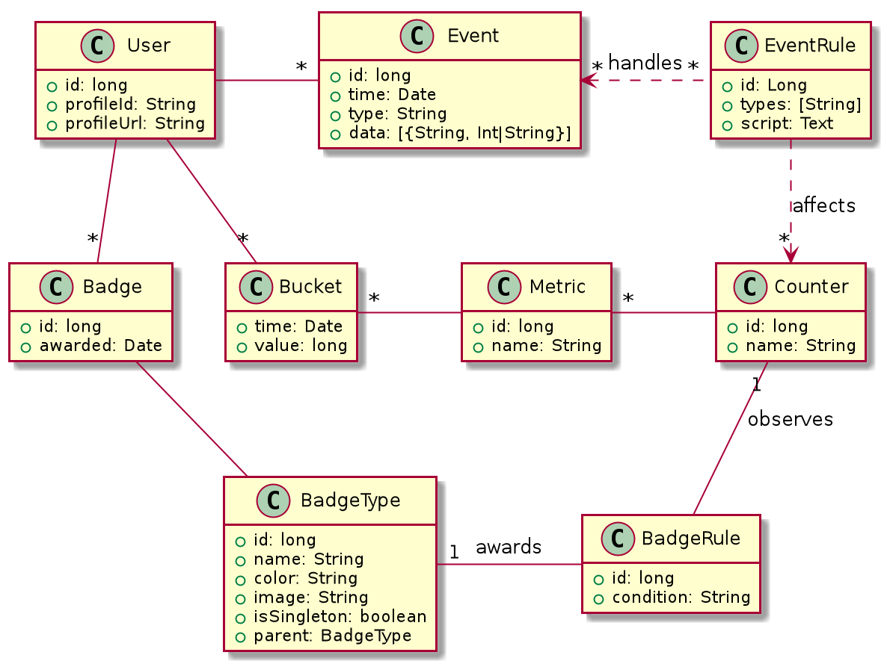

# G4mify &mdash; Object Model

This document describes the object model used by the g4mify platform. These objects are exposed via the [REST API](api.md).

### Domain

Represents a client interacting with the API, for example *StackOverflow* or *Reddit* would be domains.

### User

**API endpoint** `/api/users`

Represents a user of the domain. (ex: *StackOverflow's Users*)

### Counter

**API endpoint** `/api/counters`

Represents a value type which can be influenced by events, a counter will hold a value for each user of the system (defaults to 0)

### Metric

**API endpoint** `/api/counters/{counter}/metrics`

Allows counters to be observed over various time periods. A default metric of "total" representing the total value of the counter is present when creating a counter.

### Bucket

Contains actual values of counters per user per time slice (15 minutes).

### BadgeType

**API endpoint** `/api/badge-types`

Represents a template for a badge to be awarded to a user. `BadgeTypes` can be either `Singleton` where a user can only be awarded the badge once or `Commulative` where a user can be awarded a badge multiple times.

`Singleton` badges can define a "previous" badge which allows the definition of "badge sequences" (ex: Commiter Bronze, Silver, Gold, Platinium, ...)

### Badge

**API endpoint** `/api/users/{user}/badges`

Is an instance of a `BadgeType` awarded to a user.

### Rule

**API endpoint** `/api/rules`

Allows the domain owner to define rules to award badges when certain conditions are met. Conditions can observe counter metrics and compare them to constant values.

*TODO*: Allow conditions to compare to aggregate values (ex: average counter values)

### Event (*internal*)

**API endpoint** `/api/events`

Client applications in the domain can generate events for a specific user which affect their counters.